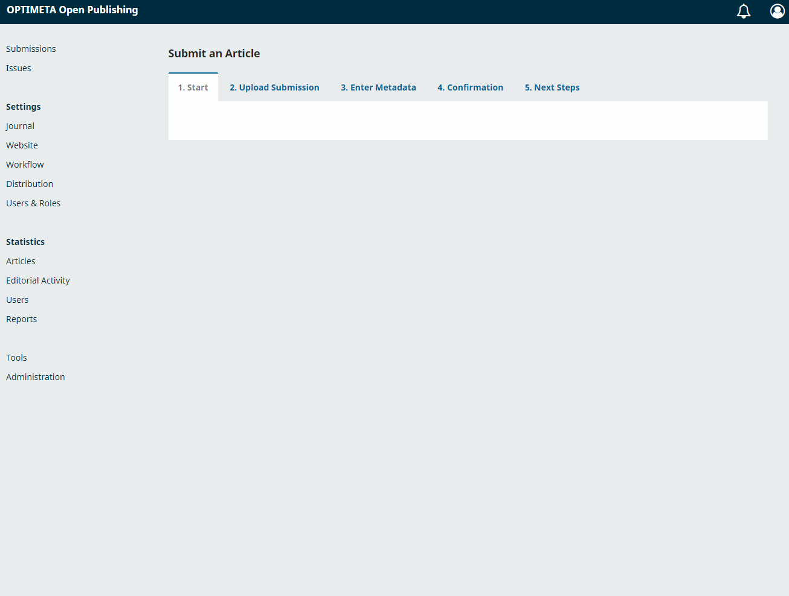
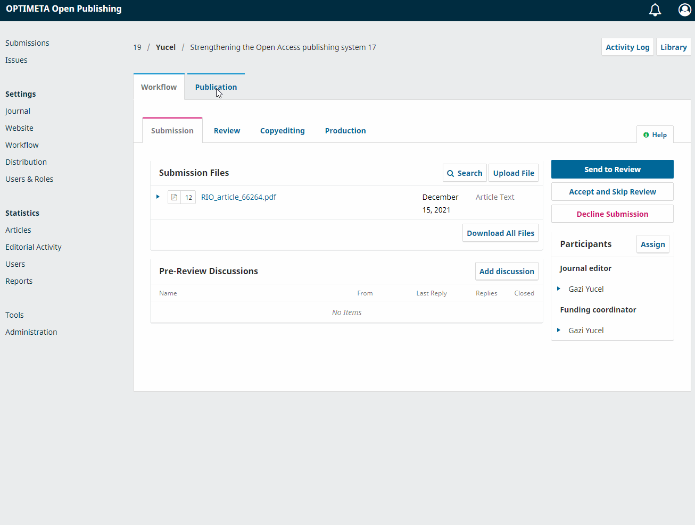

OptimetaCitations plugin
---------------------

The OPTIMETA project strengthens the Open Access (OA) ecosystem by capturing articles' citation information and spatiotemporal metadata and transferring these as open data from OA journals to openly accessible data sources. This work contributes to the metadata commons by adding crucial functionalities to [Open Journal Systems](https://pkp.sfu.ca/ojs/) (OJS), which is the most widely used free and open source software for publishing scientific journals. In this way, the aforementioned metadata can be collected, used by journals and shared with others to enable novel metascience studies and discovery of research artefacts. By combining both open source and open data, journals will be able to offer their respective communities innovative services for linking articles in a semantically meaningful way via geodata and to contribute to open citation graphs, such as COCI. Both geodata and citation data give publications better visibility and, thus, will increase findability, which in turn will increase the attraction of OA journals as publication venues.

On the technical side, this project aims to develop two OJS plugins for spatiotemporal and citation metadata, respectively. With these plugins, authors and editors can create or extract the geographic and citation data during an article's publication process, validate it if necessary and transfer it to open, freely licensed data sources, such as Wikidata. Independent OA journals run by the scientific community, professional organisations or universities usually have few human and financial resources. Therefore, OPTIMETA will rely on automatic and semi-automatic processes for efficient and reliable gathering of metadata, suitable for even non-experts to use. In addition, we will focus on making the software user-friendly and sustainable, as well as adapting the application to the needs of the user groups (authors, editors, OJS hosters and OA publishers). This is ensured by a user-centred design and iterative, agile development processes in constant exchange with the future users of the project results and the OJS community and, in particular, with a group of partner journals.

Download & Installation
---------------------
1. Download the plugin from https://github.com/TIBHannover/optimetaCitations and unzip the folder into `/plugins/generic/optimetaCitations` in OJS
2. Activate the plugin in the OJS plug-in settings
3. Fill in your username/password for all Open Access websites where you are registered (registration is on external sites)(**not yet implemented**)

Screenshots
---------------------
Add new submission wizard

Edit submission / article

Contribute
---------------------
All help is welcome: asking questions, providing documentation, testing, or even development.

Please note that this project is released with a [Contributor Code of Conduct](CONDUCT.md). By participating in this project you agree to abide by its terms.

License
---------------------
This project is published under GNU General Public License, Version 3.
