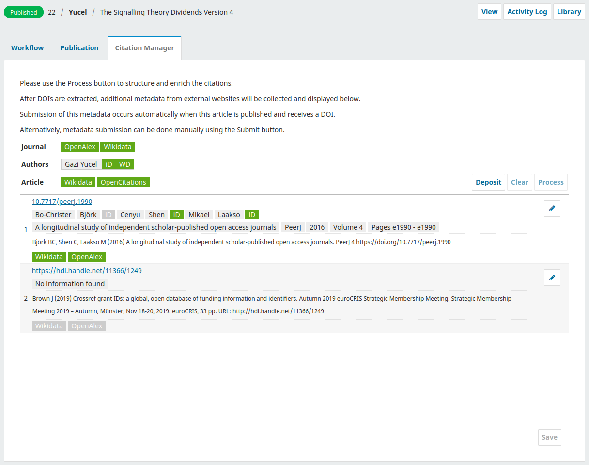

[](https://projects.tib.eu/optimeta/en/)
[](https://projects.tib.eu/komet/en/)

# Citation Manager Plugin

Citation Manager for OJS

- [Citation Manager Plugin](#citation-manager-plugin)
- [Features](#features)
    - [Extract PID's](#extract-pids)
    - [Get structured metadata from external services](#get-structured-metadata-from-external-services)
    - [Task scheduler](#task-scheduler)
    - [Deposit to OpenCitations](#deposit-to-opencitations)
    - [Deposit Wikidata.org](#deposit-wikidataorg)
- [Install and configure the plugin](#install-and-configure-the-plugin)
    - [Requirements](#requirements)
    - [Install with Git](#install-with-git)
    - [Install via direct download](#install-via-direct-download)
    - [Configuration of the plugin](#configuration-of-the-plugin)
- [Development](#development)
    - [Structure](#structure)
    - [Notes](#notes)
    - [Tests](#tests)
- [Contribute](#contribute)
- [License](#license)

[](https://www.repostatus.org/#active)
[](CODE_OF_CONDUCT.md)

# Features

## Extract PID's

- DOI
- URL
- URN
- Handle
- Arxiv

## Get structured metadata from external services

- OpenAlex.org
    - see [Models for citations](#models-for-citations)
- Orcid.org
    - given_name
    - family_name

## Task scheduler

### Process and enrich

- Batch process can be executed from Website > Plugins > Settings.
- Batch process is automatically triggered by the Task Scheduler.
- All publications which are not declined are processed.

### Deposit

- Batch deposit can be executed from Website > Plugins > Settings.
- Batch deposit is automatically triggered by the Task Scheduler.
- All publications which are published are deposited.

## Deposit to OpenCitations

Metadata

| name      | description                                  | example                                      |
|-----------|----------------------------------------------|----------------------------------------------|
| id        | doi, issn, isbn, url, wikidata, wikipedia    | doi:3233/ds-170012                           |
| title     | the title of the document                    |                                              |                                         
| author    | name of author(s), orcid if available        | Yücel, Gazi [orcid:0000-0002-2013-6920]      |
| pub_date  | the date of publication of the document      | 2021-02-28                                   |
| venue     | the venue of the document                    | Journal of Public Knowledge [issn:0378-5955] |
| volume    | the volume if document in journal            |                                              |
| issue     | the issue if document in journal             |                                              |
| page      | the page range of document (first-last page) | 59-81                                        |
| type      | type of document                             | journal article                              |
| publisher | the publisher of the document                |                                              |
| editor    | name of the editor(s)                        | Yücel, Gazi [orcid:0000-0002-2013-6920]      |

Citing and cited relation

| name                    | description                             | example            |
|-------------------------|-----------------------------------------|--------------------|
| citing_id               | identifier of the citing document       | doi:3233/ds-170012 |
| citing_publication_date | publication date of the citing document | 2021-02-28         |
| cited_id                | identifier of the cited document        | doi:3233/ds-170012 |
| cited_publication_date  | publication date of the cited document  | 2022-02-28         |

Please see https://github.com/opencitations/crowdsourcing for more information.

## Deposit Wikidata.org

Only items which have unique identifiers will be deposited to Wikidata.

1. author
    - labels (en, ...)
    - instance of ([P31](https://www.wikidata.org/wiki/Property:P31)) >
      human ([Q5](https://www.wikidata.org/wiki/Q5))
    - orcid id ([P496](https://www.wikidata.org/wiki/Property:P496)) (identifier)
2. journal
    - labels (en, ...)
    - instance of ([P31](https://www.wikidata.org/wiki/Property:P31)) >
      scientific journal ([Q5633421](https://www.wikidata.org/wiki/Q5633421))
    - issn ([P236](https://www.wikidata.org/wiki/Property:P236)) (identifier)
    - title ([P1476](https://www.wikidata.org/wiki/Property:P1476))
3. cited article (scholarly article)
    - labels (en, ...)
    - instance of ([P31](https://www.wikidata.org/wiki/Property:P31)) >
      scholarly article ([Q13442814](https://www.wikidata.org/wiki/Q13442814))
    - doi ([P356](https://www.wikidata.org/wiki/Property:P356)) (identifier)
    - title ([P1476](https://www.wikidata.org/wiki/Property:P1476))
4. main article (scholarly article)
    - labels (en, ...)
    - instance of ([P31](https://www.wikidata.org/wiki/Property:P31)) >
      scholarly article ([Q13442814](https://www.wikidata.org/wiki/Q13442814))
    - doi ([P356](https://www.wikidata.org/wiki/Property:P356)) (identifier)
    - title ([P1476](https://www.wikidata.org/wiki/Property:P1476))
    - publication date ([P577](https://www.wikidata.org/wiki/Property:P577))
    - volume ([P478](https://www.wikidata.org/wiki/Property:P478))
    - author ([P50](https://www.wikidata.org/wiki/Property:P50)) [1. author]
    - published in ([P1433](https://www.wikidata.org/wiki/Property:P1433)) [2. journal]
    - cites work ([P2860](https://www.wikidata.org/wiki/Property:P2860)) [3. cited article]

# Install and configure the plugin

## Requirements

- PHP 8.0+

## Install with Git

Get the correct version for your OJS version:

- branch stable-3_3_0: use this version for OJS version 3.3.0.x  
  `git clone -b stable-3_3_0 https://github.com/TIBHannover/citationManager`
- branch stable-3_4_0: use this version for OJS version 3.4.0.x  
  `git clone -b stable-3_4_0 https://github.com/TIBHannover/citationManager`

## Install via direct download

- Download release for your OJS version from [here](https://github.com/TIBHannover/citationManager/releases).
  _Note the correct version for you OJS version._
- Alternatively, download the code with the option 'Download ZIP'.
  _Note the correct branch for your OJS version._
- Extract the downloaded file to `/plugins/generic/citationManager`.

## Configuration of the plugin

- Login in your OJS instance as an Administrator or Manager
- Navigate to Website > Plugins > Installed Plugins > Generic Plugins > Citation Manager Plugin
    - Activate the plugin by clicking the checkbox
- Click on the arrow at the left and click "Settings"
- Fill in your authentication info as described in the sections [OpenCitations](#opencitationsorg-crowdsourcing)
  and [Wikidata](#wikidataorg)
- Click Save

### OpenCitations.org crowdsourcing

Depositing at OpenCitations will be done through GitHub issues of [OpenCitations/crowdsourcing](https://github.com/OpenCitations/crowdsourcing). \
For this you need a GitHub account, if you have none please register one through https://github.com/signup.

- Login at https://github.com and navigate to https://github.com/settings/tokens
- Click "Generate new token" button at the right top
- At the input field "Note" typ in "OpenCitations Crowdsourcing"
- Select "No expiration" at Expiration
- Check the checkbox "public_repo"; leave all other checkboxes unchecked
- Click on the button "Generate token"
- You will be provided the token; save this token, as you will not shown this again
- Login to your OJS with an administrator account
- Navigate to Settings > Website > Plugins and find "Citation Manager Plugin" on the page
- Click on the arrow at the left and click "Settings"
- At Owner field, fill in "OpenCitations"
- At Repository field, fill in "crowdsourcing"
- Fill in your token, which you generated above
- Click Save

### Wikidata.org

Depositing at Wikidata.org will be done through the wikidata API.  
For this you need an account on Wikidata.org.  
If you have none please register one through https://www.wikidata.org/w/index.php?title=Special:CreateAccount.

- Login at https://www.wikidata.org and navigate to https://www.wikidata.org/wiki/Special:BotPasswords
- Type a name (e.g. OJSCitationManager) at "Bot name" in the section "Create a new bot password"
- Check the following permissions: "High-volume editing", "Edit existing pages", Edit protected pages, "Create, edit,
  and move pages"
- Optionally, add your server IP address(es) into the field "Allowed IP ranges"
- Click on the button "Create"
- After creation, you will be redirected to a page where your credentials are shown
- Save these data somewhere safe
- Login to your OJS with an administrator account
- Navigate to Settings > Website > Plugins and find "Citation Manager Plugin" on the page
- Click on the arrow at the left and click "Settings"
- At "Wikidata bot username" field, fill in the username which you saved previously (e.g. Username@OJSCitationManager)
- At "Wikidata bot password", fill in the password which you have saved previously
- Click Save

# Screenshot(s)



# Development

- Fork the repository
- Make your changes
- Open a PR with your changes

## Structure

    .
    ├─ assets                        # Styles, images, javascript files
    ├─ classes                       # Main folder with models / logic
    │  ├─ DataModels                 # Data models used in this plugin
    │  │  ├─ Citation                # Data models for citations, authors in citations
    │  │  └─ Metadata                # Metadata for OJS authors, journals and publications
    │  └─ Db                         # Database related classes
    │  │  ├─ PluginDAO.php           # Retrieve / save data to / from database
    │  │  └─ PluginSchema.php        # Schema extestions for data models
    │  ├─ External                   # Classes for external services
    │  |  ├─ Wikidata                # Classes for Wikidata.org
    |  |  |  ├─ DataModels           # Data models for this service, e.g. mappings
    │  |  |  ├─ Api.php              # Methods for connecting to their API
    │  |  |  ├─ Inbound.php          # Methods for retrieving data
    │  |  |  └─ Outbound.php         # Methods for depositing data 
    |  |  ├─ ... Other services      # Other services follow the same structure
    |  |  ├─ ApiAbstract.php         # This class is used by service Api class
    |  |  ├─ InboundAbstract.php     # This class is used by service Inbound class
    |  |  └─ OutboundAbstract.php    # This class is used by service Outbound class
    │  ├─ FrontEnd                   # Classes for the front end, e.g. ArticleView
    │  ├─ Handlers                   # Handlers, e.g. Outbound, Inbound, API
    │  ├─ Helpers                    # Helper classes
    │  ├─ PID                        # PID classes
    │  ├─ ScheduledTasks             # Classes for the scheduler
    │  ├─ Settings                   # Settings classes
    │  └─ Workflow                   # Classes or the workflow and submission wizard
    ├─ cypress                       # Cypress tests
    ├─ docs                          # Documentation, examples
    ├─ locale                        # Language files
    ├─ templates                     # Templates folder
    ├─ tests                         # Tests folder
    │  └─ classes                    # Classes for tests
    ├─ vendor                        # Composer autoload and dependencies
    ├─ .gitignore                    # Git ignore file
    ├─ CitationManagerPlugin.php     # Main class of plugin
    ├─ composer.json                 # Composer configuration file
    ├─ CODE_OF_CONDUCT.md            # Code of conduct
    ├─ cypress.config.js             # Cypress configuration file
    ├─ index.php                     # Entry point plugin (ojs version 3.3.0)
    ├─ LICENSE                       # License file
    ├─ README.md                     # This file
    ├─ package.json                  # npm packaging configuration
    ├─ scheduledTasks.xml            # Scheduler configuration file
    └─ version.xml                   # Version information of the plugin

Notes

- Autoload of the classes in the folder `classes/` is done with composer according 
  to the PSR-4 specification.
- All classes have namespaces and are structured according to PSR-4 standard.
- If you add or remove classes in the `classes` folder, run the following
  command to update autoload files: `composer dump-autoload -o --no-dev`.
- Running `composer install -o --no-dev` or `composer update -o --no-dev`
  will also generate the autoload files.
- The `-o` option generates the optimised files ready for production.

## Debugging

There is a isDebugMode constant in file CitationManagerPlugin.php.
This constant puts the plugin in debugging mode.
Extra debug information will be written to the log file (see LogHelper class)
such as API calls.
Debug information is written to the log file in the `files_dir` directory of your OJS instance.
You can find the `files_dir` constant in your config.inc.php file.

_Careful with sensitive information, (passwords, tokens) will be written in plain text._

## Tests

**Test classes**

If you are developing, you might use the classes in `tests/classes/`.
The classes in this folder have the same folder and namespace structure as in `classes` folder.
The purpose of these classes is to override the main classes.
You can accomplish this by running the composer command `composer dump-autoload -o --dev`.
If this is done, then test or sandbox versions of API's will be used.
For example test.wikidata.org instead of www.wikidata.org.
Autoload of the classes is done with composer [classmap](https://getcomposer.org/doc/04-schema.md#classmap).  
First the classes in `tests/classes/` are loaded, after which the classes in `classes/` are loaded.
By doing this in this order, all classes present in `tests/classes/` will override the classes in `classes/`.

**Headless tests**

```bash
npm install

# start containers
npm run-script test_compose

# run tests with UI
npm run-script test_open
```

# Data models

## Models for citations

**CitationModel**

| name              | description                                                       |
|-------------------|-------------------------------------------------------------------|
| doi               | The DOI for the work                                              |
| title             | The title of this work                                            |
| publication_year  | The year this work was published                                  |
| publication_date  | The publication date, formatted as an ISO 8601 date eg 2018-02-13 |
| type              | The type or genre of the work, eg journal-article                 |
| volume            | The volume of the issue of the journal, eg 495                    |
| issue             | The issue of the journal, eg 7442                                 |
| pages             | The number of pages of the work/article, eg 4                     |
| first_page        | The first page of the work/article, eg 49                         |
| last_page         | The last page of the work/article, eg 59                          |
| abstract          | The abstract of this work                                         |
| authors           | List of AuthorModel objects                                       |
| journal_name      | Name of the journal                                               |
| journal_issn_l    | Issn_l of the journal                                             |
| journal_publisher | Publisher name of the journal                                     |
| url               | URL for the work                                                  |
| urn               | URN for the work                                                  |
| arxiv_id          | The arxiv id of the work                                          |
| handle_id         | The handle id of the work                                         |
| openalex_id       | The OpenAlex ID of the work                                       |
| wikidata_id       | The Wikidata QID of the work                                      |
| opencitations_id  | Open Citations ID                                                 |
| github_issue_id   | GitHub Issue ID used by Open Citations                            |
| raw               | The unchanged raw citation                                        |
| isProcessed       | Is processed / structured                                         |

**AuthorModel**

| name         | description                                      |
|--------------|--------------------------------------------------|
| orcid_id     | The ORCID ID for this author                     |
| display_name | The name of the author as a single string        |
| given_name   | The given name of the author as a single string  |
| family_name  | The family name of the author as a single string |
| wikidata_id  | The Wikidata QID                                 |
| openalex_id  | The OpenAlex ID                                  |

## Metadata of OJS models

**MetadataJournal**

| name        | description                  |
|-------------|------------------------------|
| openalex_id | The OpenAlex ID of the work  |
| wikidata_id | The Wikidata QID of the work |

**MetadataAuthor**

| name        | description                  |
|-------------|------------------------------|
| openalex_id | The OpenAlex ID of the work  | 
| wikidata_id | The Wikidata QID of the work |

**MetadataPublication**

| name             | description                            |
|------------------|----------------------------------------|
| openalex_id      | The OpenAlex ID of the work            |
| wikidata_id      | The Wikidata QID of the work           |
| opencitations_id | Open Citations ID                      |
| github_issue_id  | GitHub Issue ID used by Open Citations |

# Contribute

All help is welcome: asking questions, providing documentation, testing, or even development.

Please note that this project is released with a [Contributor Code of Conduct](CODE_OF_CONDUCT.md).
By participating in this project you agree to abide by its terms.

# License

This project is published under GNU General Public License, Version 3.

---
